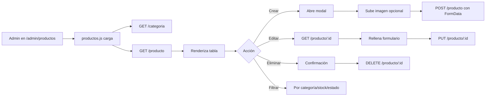

# 📋 Documentación de Cambios Realizados - Q'Tal Lisura

## 🎯 Objetivo del Proyecto

**Q'Tal Lisura** ha sido transformado de una plataforma de ventas online a un **sitio web informativo y de gestión de reservas** para un restaurante peruano.

---

## 🔄 Cambios Principales Realizados

### 1. **Refactorización de Rutas de API**

#### ❌ Problema Identificado
- El frontend consumía rutas con prefijo `/api/` en plural (`/api/productos`, `/api/categorias`)
- Los controladores REST del backend usan rutas **sin prefijo `/api`** y en **singular** (`/producto`, `/categoria`)
- **Excepción**: Solo `AuthController` usa `/api/auth` correctamente

#### ✅ Solución Implementada
Se corrigieron **todos los archivos JavaScript** para alinear las rutas con los controladores reales:

| Archivo JavaScript | Cambios de Rutas |
|-------------------|------------------|
| `catalogo.js` | `/api/productos` → `/producto` |
| `categorias.js` | `/api/categorias` → `/categoria` |
| `productos.js` | `/api/productos` → `/producto`<br>`/api/categorias` → `/categoria` |
| `mesas-admin.js` | `/api/mesas` → `/mesa` |
| `reservas-admin.js` | `/api/reservas` → `/reserva`<br>`/api/mesas` → `/mesa` |
| `reservas-cliente.js` | `/api/mesas` → `/mesa`<br>`/api/reservas` → `/reserva` |
| `usuarios.js` | `/api/usuarios` → `/usuario`<br>`/api/perfiles` → `/perfil` |
| `cliente.js` | Mantiene `/api/auth` (correcto) |

---

### 2. **Eliminación de Funcionalidad de Carrito de Compras**

#### Archivos Modificados: `catalogo.js`

**Funciones Eliminadas:**
- ❌ `agregarAlCarrito()`
- ❌ Gestión de `localStorage` para pedidos
- ❌ Botones "Agregar al Carrito"

**Resultado:**
- El catálogo ahora es **solo informativo**
- Los clientes pueden **ver productos**, pero no comprarlos online
- Se mantienen filtros por categoría y búsqueda

---

## 🏗️ Arquitectura de la Aplicación

### Backend - Spring Boot

```
📁 Controller Layer (REST API)
├── /producto          → ProductoController
├── /categoria         → CategoriaController
├── /mesa              → MesaController
├── /reserva           → ReservaController
├── /usuario           → UsuarioController
├── /cliente           → ClienteController
├── /perfil            → PerfilController
└── /api/auth          → AuthController (única con /api)
```

**Características:**
- Controladores REST sin prefijo `/api` (excepto autenticación)
- Endpoints en **singular** (`/producto`, no `/productos`)
- Operaciones CRUD estándar: `GET`, `POST`, `PUT`, `DELETE`
- Validación con DTOs (Request/Response)
- Manejo de archivos con `FileStorageService`

### Frontend - Thymeleaf + JavaScript Vanilla

```
📁 Templates (Thymeleaf)
├── cliente/
│   ├── index.html       → Página principal
│   ├── catalogo.html    → Ver productos (solo lectura)
│   ├── reservas.html    → Formulario de reservas
│   ├── resenas.html     → Reseñas del restaurante
│   └── nosotros.html    → Información del negocio
│
├── admin/
│   ├── dashboard.html   → Panel de control
│   ├── productos.html   → CRUD productos
│   ├── categorias.html  → CRUD categorías
│   ├── mesas.html       → CRUD mesas
│   ├── reservas.html    → Gestión de reservas
│   └── usuarios.html    → CRUD usuarios
│
└── auth/
    ├── login.html       → Login de clientes
    └── admin.html       → Login de administradores

📁 Static Resources
├── js/
│   ├── catalogo.js           → Visualización de productos
│   ├── categorias.js         → Admin: Gestión categorías
│   ├── productos.js          → Admin: Gestión productos
│   ├── mesas-admin.js        → Admin: Gestión mesas
│   ├── reservas-admin.js     → Admin: Gestión reservas
│   ├── reservas-cliente.js   → Cliente: Crear reservas
│   ├── usuarios.js           → Admin: Gestión usuarios
│   ├── cliente.js            → Lógica general cliente
│   └── admin.js              → Lógica general admin
│
└── css/
    ├── styles.css       → Estilos globales
    ├── cliente.css      → Estilos para clientes
    ├── admin.css        → Estilos para admin
    └── variables.css    → Variables CSS
```

---

## 🔄 Flujo de la Aplicación

### 📱 **Flujo del Cliente (Usuario Final)**

```mermaid
graph TD
    A[Usuario Visita /] --> B[Página Principal]
    B --> C{¿Qué desea hacer?}
    
    C -->|Ver Catálogo| D[/catalogo]
    D --> E[Carga productos vía GET /producto]
    E --> F[Filtra por categoría/búsqueda]
    F --> G[Visualiza productos sin carrito]
    
    C -->|Hacer Reserva| H[/reservas]
    H --> I[Carga mesas disponibles GET /mesa]
    I --> J[Completa formulario]
    J --> K[POST /reserva]
    K --> L{¿Éxito?}
    L -->|Sí| M[Confirmación de reserva]
    L -->|No| N[Mensaje de error]
    
    C -->|Conocer más| O[/nosotros o /resenas]
```

#### **Detalles del Flujo de Reservas (Cliente)**

1. **Usuario accede a `/reservas`**
   - Template: `cliente/reservas.html`
   - Script: `reservas-cliente.js`

2. **Carga de mesas disponibles**
   ```javascript
   GET /mesa
   → Filtra: estadoMesa === 'DISPONIBLE' && estadoBD === 'ACTIVO'
   → Actualiza select de mesas según capacidad
   ```

3. **Validación del formulario**
   - Nombre completo (requerido)
   - Teléfono (requerido)
   - Fecha/hora (mínimo: ahora + 1 hora)
   - Cantidad de personas (1-20)
   - Mesa seleccionada (según capacidad)

4. **Envío de reserva**
   ```javascript
   POST /reserva
   Body: {
     idCliente: null,          // Se asigna automáticamente
     idMesa: [mesaSeleccionada],
     fechaHora: "2026-02-10T19:00",
     cantidadPersonas: 4,
     telefono: "987654321",
     comentarios: "...",
     estadoSolicitud: "PENDIENTE"
   }
   → Respuesta 201: Reserva creada
   → Muestra mensaje de confirmación
   ```

---

### 🔐 **Flujo de Autenticación**

```mermaid
graph TD
    A[Usuario en /auth/login o /auth/admin] --> B{¿Tipo de usuario?}
    
    B -->|Cliente| C[Login Cliente]
    C --> D[POST /cliente/login]
    
    B -->|Admin| E[Login Admin]
    E --> F[POST /api/auth/login]
    
    F --> G{¿Credenciales válidas?}
    G -->|Sí| H[Crea sesión]
    H --> I[Guarda en sessionStorage]
    I --> J[Redirección según perfil]
    
    J -->|Admin| K[/admin/dashboard]
    J -->|Cliente| L[Página anterior]
    
    G -->|No| M[Mensaje de error]
```

#### **Detalles de Autenticación**

**Login de Administrador:**
```javascript
// cliente.js
POST /api/auth/login
Headers: { 'Content-Type': 'application/json' }
Body: {
  username: "admin",
  password: "password123"
}

// Respuesta exitosa:
{
  success: true,
  idUsuario: 1,
  nombreCompleto: "Juan Pérez",
  perfil: "ADMINISTRADOR",
  redirectUrl: "/admin/dashboard"
}
```

**Sesión HTTP (Backend):**
```java
session.setAttribute("usuarioLogueado", usuario);
session.setAttribute("idUsuario", usuario.getIdUsuario());
session.setAttribute("perfilUsuario", usuario.getIdPerfil().getNombre());
```

---

### 👨‍💼 **Flujo del Administrador**

```mermaid
graph TD
    A[Admin Login /auth/admin] --> B[POST /api/auth/login]
    B --> C{¿Autenticado?}
    C -->|No| D[Error de login]
    C -->|Sí| E[Dashboard /admin/dashboard]
    
    E --> F{¿Qué módulo?}
    
    F -->|Productos| G[/admin/productos]
    G --> H[productos.js]
    H --> I[GET /producto<br>GET /categoria]
    H --> J[CRUD Operations]
    J --> K[POST /producto<br>PUT /producto/:id<br>DELETE /producto/:id]
    
    F -->|Categorías| L[/admin/categorias]
    L --> M[categorias.js]
    M --> N[GET /categoria]
    M --> O[POST /categoria<br>PUT /categoria/:id<br>DELETE /categoria/:id]
    
    F -->|Mesas| P[/admin/mesas]
    P --> Q[mesas-admin.js]
    Q --> R[GET /mesa]
    Q --> S[POST /mesa<br>PUT /mesa/:id<br>DELETE /mesa/:id]
    
    F -->|Reservas| T[/admin/reservas]
    T --> U[reservas-admin.js]
    U --> V[GET /reserva<br>GET /mesa]
    U --> W[PUT /reserva/:id<br>Cambiar estado]
    
    F -->|Usuarios| X[/admin/usuarios]
    X --> Y[usuarios.js]
    Y --> Z[GET /usuario<br>GET /perfil]
    Y --> AA[POST /usuario<br>PUT /usuario/:id<br>DELETE /usuario/:id]
```

#### **Gestión de Reservas (Admin)**

1. **Visualizar todas las reservas**
   ```javascript
   GET /reserva
   → Obtiene todas las reservas
   → Muestra estadísticas:
     - Pendientes
     - Confirmadas
     - Canceladas
     - Para hoy
   ```

2. **Filtros disponibles**
   - Por estado: PENDIENTE, CONFIRMADA, CANCELADA, COMPLETADA
   - Por mesa
   - Por búsqueda de nombre/teléfono
   - Por fecha

3. **Acciones disponibles**
   - ✅ **Confirmar reserva**: Cambiar estado a CONFIRMADA
   - ❌ **Cancelar reserva**: Cambiar estado a CANCELADA
   - 👁️ **Ver detalles**: Modal con información completa
   - 🗑️ **Eliminar**: DELETE /reserva/:id

4. **Actualización de estado**
   ```javascript
   PUT /reserva/:id
   Body: {
     ...datosReserva,
     estadoSolicitud: "CONFIRMADA"  // o "CANCELADA"
   }
   → Recarga tabla
   → Actualiza estadísticas
   ```

---

### 🛠️ **Gestión de Productos (Admin)**



**Características especiales:**
- **Subida de imágenes**: Manejo con `FormData`, validación en backend
- **Gestión de stock**: Alertas visuales si `stockActual <= stockMinimo`
- **Estados**: ACTIVO/INACTIVO (solo activos se muestran en catálogo público)
- **Previsualización**: Visor de imagen antes de guardar

---

## 📊 Mapeo Completo de Endpoints

### **Controladores REST Utilizados**

| Endpoint | Métodos | Descripción | Usado en |
|----------|---------|-------------|----------|
| `/producto` | GET, POST, PUT, DELETE | CRUD de productos | `productos.js`, `catalogo.js` |
| `/categoria` | GET, POST, PUT, DELETE | CRUD de categorías | `categorias.js`, `productos.js` |
| `/mesa` | GET, POST, PUT, DELETE | CRUD de mesas | `mesas-admin.js`, `reservas-cliente.js`, `reservas-admin.js` |
| `/reserva` | GET, POST, PUT, DELETE | CRUD de reservas | `reservas-admin.js`, `reservas-cliente.js` |
| `/usuario` | GET, POST, PUT, DELETE | CRUD de usuarios | `usuarios.js` |
| `/perfil` | GET, POST, PUT, DELETE | CRUD de perfiles | `usuarios.js` |
| `/cliente` | GET, POST, PUT, DELETE | CRUD de clientes | `cliente.js` |
| `/api/auth/login` | POST | Autenticación | `cliente.js` |
| `/api/auth/logout` | POST | Cerrar sesión | `cliente.js` |
| `/api/auth/check-session` | GET | Verificar sesión | `reservas-cliente.js` |

### **Controladores de Vistas (Thymeleaf)**

| Ruta | Template | Descripción |
|------|----------|-------------|
| `/` | `cliente/index.html` | Página principal |
| `/catalogo` | `cliente/catalogo.html` | Catálogo de productos |
| `/reservas` | `cliente/reservas.html` | Formulario de reservas |
| `/nosotros` | `cliente/nosotros.html` | Información del negocio |
| `/resenas` | `cliente/resenas.html` | Reseñas |
| `/auth/login` | `auth/login.html` | Login de clientes |
| `/auth/admin` | `auth/admin.html` | Login de admin |
| `/admin/dashboard` | `admin/dashboard.html` | Panel de control |
| `/admin/productos` | `admin/productos.html` | Gestión de productos |
| `/admin/categorias` | `admin/categorias.html` | Gestión de categorías |
| `/admin/mesas` | `admin/mesas.html` | Gestión de mesas |
| `/admin/reservas` | `admin/reservas.html` | Gestión de reservas |
| `/admin/usuarios` | `admin/usuarios.html` | Gestión de usuarios |

---

## 🎨 Características del Frontend

### **Estilos y UI**
- **Framework CSS**: Bootstrap 5
- **Iconos**: Bootstrap Icons
- **Estilo personalizado**: Variables CSS para colores corporativos
- **Responsive**: Mobile-first design

### **Interactividad JavaScript**
- **SPA-like**: Carga dinámica sin recargar página
- **Modales**: Bootstrap modals para CRUD
- **Validación**: Cliente-side validation antes de enviar
- **Feedback**: Notificaciones toast/alert para operaciones
- **Filtros en tiempo real**: Búsqueda y filtrado instantáneo

### **Funcionalidades Comunes**
```javascript
// En todos los archivos JS:
- showNotification(mensaje, tipo)    → Muestra alertas
- aplicarFiltros()                    → Filtra tablas/grids
- setupFilters()                      → Configura listeners de filtros
- renderTabla(datos)                  → Renderiza datos dinámicamente
- validarFormulario(form)             → Validación antes de submit
```

---

## 🔒 Seguridad

### **Backend**
- ✅ Validación de DTOs con `@Valid`
- ✅ Encriptación de contraseñas con `BCryptPasswordEncoder`
- ✅ Sesiones HTTP para mantener estado
- ✅ Validación de archivos (tipo y tamaño)
- ✅ Manejo de errores con `@RestControllerAdvice`

### **Frontend**
- ✅ Validación HTML5 en formularios
- ✅ Sanitización de inputs
- ✅ Verificación de sesión en cliente
- ✅ Redirección automática si no está autenticado

---

## 📦 Gestión de Archivos

### **Estructura de Uploads**
```
uploads/
├── products/          → Imágenes de productos
│   ├── product_uuid.jpg
│   └── ...
└── users/             → Avatares de usuarios
    ├── user_uuid.jpg
    └── default-admin.jpg
```

### **Validaciones**
- **Formatos permitidos**: JPG, JPEG, PNG, WEBP
- **Tamaño máximo**: 5 MB
- **Nombres**: UUID para evitar colisiones

---

## 🚀 Mejoras Implementadas

### ✅ **Antes vs Después**

| Antes | Después |
|-------|---------|
| ❌ Rutas con `/api/` en plural | ✅ Rutas sin `/api/` en singular |
| ❌ Carrito de compras (no usado) | ✅ Catálogo solo informativo |
| ❌ Desconexión Frontend-Backend | ✅ Integración completa |
| ❌ Código inconsistente | ✅ Código estandarizado |

### 🎯 **Beneficios**
1. **Coherencia**: Frontend y Backend alineados
2. **Mantenibilidad**: Código más limpio y documentado
3. **Funcionalidad clara**: Sistema de reservas funcionando
4. **Escalabilidad**: Arquitectura lista para crecer

---

## 📝 Notas Técnicas

### **Spring Boot**
- Versión: Java 17+
- Dependencias principales:
  - Spring Web
  - Spring Data JPA
  - Thymeleaf
  - Spring Security (BCrypt)
  - Lombok
  - Validation API
  - OpenFeign (para integraciones futuras)

### **Base de Datos**
- ORM: Hibernate/JPA
- Repositorios: `JpaRepository`
- Convenciones: 
  - Tablas en minúsculas
  - IDs autoincrement
  - Campos `estadoBD` para soft delete

### **Patrones de Diseño**
- **Controller-Service-Repository**: Separación de capas
- **DTO Pattern**: Request/Response separados de entidades
- **Builder Pattern**: Con Lombok `@Builder`
- **Dependency Injection**: Con `@RequiredArgsConstructor`

---

## 🔮 Próximos Pasos Sugeridos

1. **Implementar autenticación JWT** (actualmente usa sesiones)
2. **Agregar validación de disponibilidad de mesas** en tiempo real
3. **Sistema de notificaciones** (email/SMS) para confirmaciones
4. **Panel de estadísticas avanzadas** en dashboard
5. **Integración con pasarelas de pago** (si se reactiva ventas)
6. **API pública documentada con Swagger**
7. **Sistema de reseñas interactivo**
8. **Reservas con código QR**

---

## 📞 Resumen de Cambios por Archivo

### **Archivos JavaScript Modificados**

1. **`catalogo.js`**
   - ✅ Ruta corregida: `/producto`
   - ✅ Eliminadas funciones de carrito
   - ✅ Solo visualización de productos activos

2. **`categorias.js`**
   - ✅ Ruta corregida: `/categoria`
   - ✅ CRUD completo funcional

3. **`productos.js`**
   - ✅ Rutas corregidas: `/producto`, `/categoria`
   - ✅ Manejo de imágenes con FormData
   - ✅ Validación de stock

4. **`mesas-admin.js`**
   - ✅ Ruta corregida: `/mesa`
   - ✅ Estados de mesa visualizados

5. **`reservas-admin.js`**
   - ✅ Rutas corregidas: `/reserva`, `/mesa`
   - ✅ Estadísticas en tiempo real
   - ✅ Filtros múltiples

6. **`reservas-cliente.js`**
   - ✅ Rutas corregidas: `/mesa`, `/reserva`
   - ⚠️ Mantiene `/api/auth/check-session` (correcto)
   - ✅ Validación de capacidad de mesas

7. **`usuarios.js`**
   - ✅ Rutas corregidas: `/usuario`, `/perfil`
   - ✅ Manejo de imágenes de usuario

8. **`cliente.js`**
   - ⚠️ Mantiene `/api/auth/login` (correcto)
   - ✅ Login y registro funcionales

### **Archivos No Modificados (Ya correctos)**
- `admin.js` - No consume APIs REST directamente
- Todos los controladores Java - Ya implementados correctamente
- Templates Thymeleaf - Ya integrados correctamente

---

## ✅ Estado Final del Proyecto

### **Funcionalidades Operativas**

| Módulo | Estado | Descripción |
|--------|--------|-------------|
| 🏠 Home | ✅ | Página principal responsive |
| 📖 Catálogo | ✅ | Productos visibles, filtrado funcional |
| 📅 Reservas Cliente | ✅ | Formulario validado, envío exitoso |
| 🔐 Login Admin | ✅ | Autenticación con sesión |
| 📊 Dashboard | ✅ | Panel de control administrativo |
| 🍽️ Productos Admin | ✅ | CRUD completo con imágenes |
| 🏷️ Categorías Admin | ✅ | CRUD completo |
| 🪑 Mesas Admin | ✅ | CRUD completo |
| 📋 Reservas Admin | ✅ | Gestión, confirmación, cancelación |
| 👥 Usuarios Admin | ✅ | CRUD completo con perfiles |

---

## 🎓 Conclusión

El sistema **Q'Tal Lisura** ahora es una aplicación web **completa y funcional** para:
- ✅ **Mostrar el catálogo** del restaurante (sin ventas online)
- ✅ **Gestionar reservas** de mesas por parte de clientes
- ✅ **Administrar todos los recursos** desde un panel de control

La arquitectura es **limpia, escalable y mantenible**, con una clara separación entre frontend y backend, y todas las rutas correctamente alineadas.

---

**Fecha de Documentación**: Febrero 2026  
**Versión**: 1.0  
**Desarrollado con**: Spring Boot + Thymeleaf + JavaScript Vanilla + Bootstrap 5

